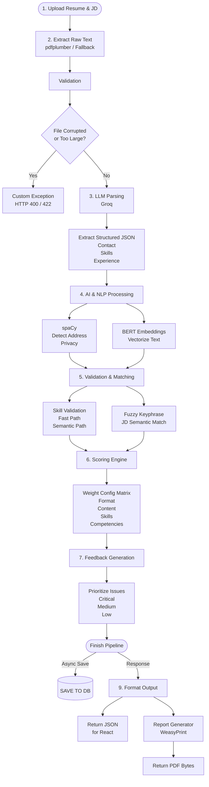
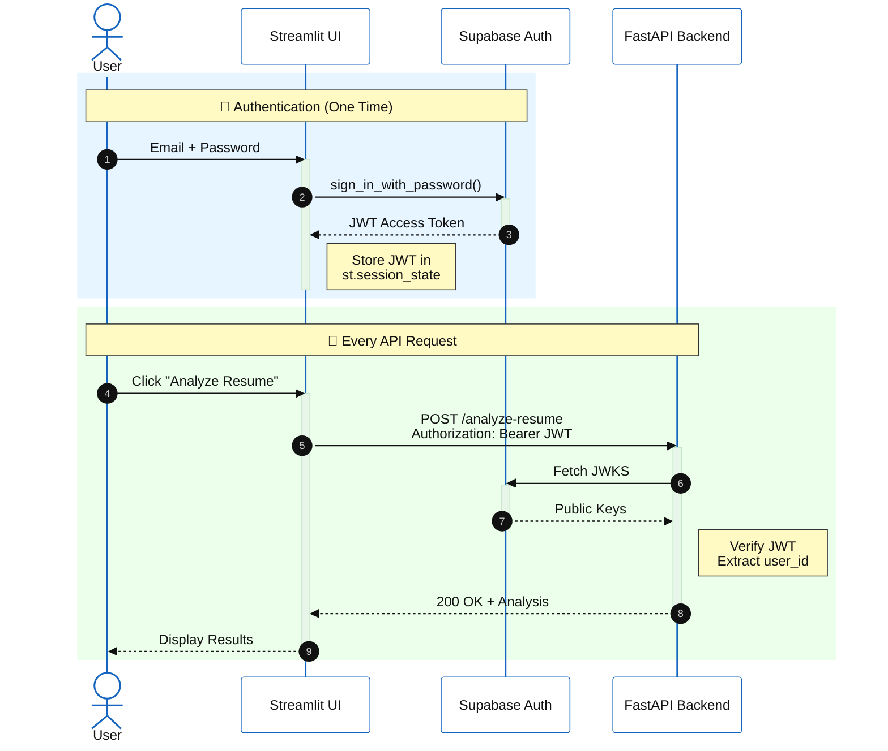
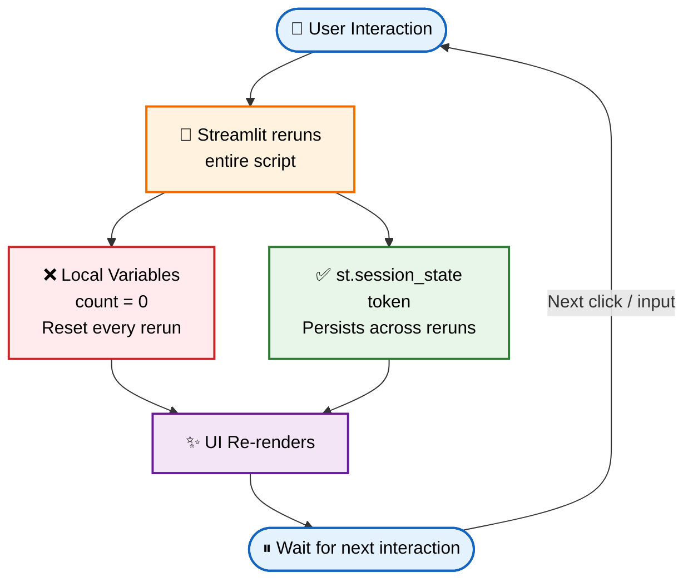
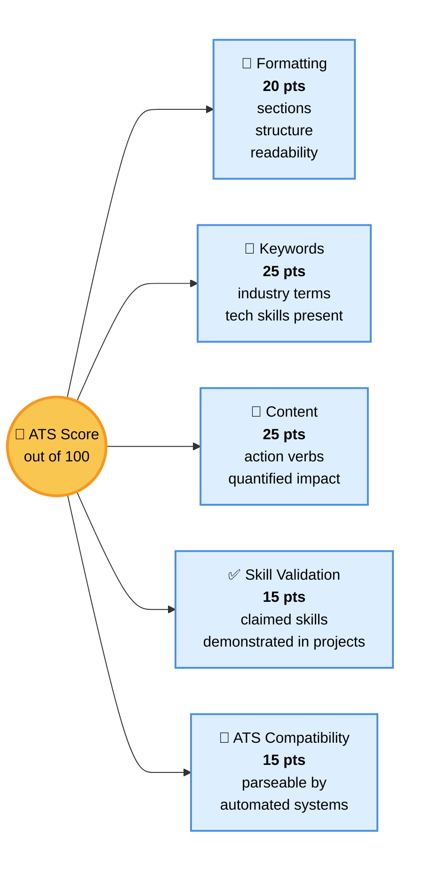

# ATS Resume Scorer

A web app that scores how well a resume matches a job description and returns actionable feedback. Built with FastAPI + Streamlit, using spaCy and Sentence Transformers for NLP and the Groq API for LLM-generated suggestions.

## What it does



1. Upload a resume (PDF / DOC / DOCX) and paste a job description.
2. The backend parses the resume, extracts skills and experience, and compares them to the JD using semantic similarity.
3. You get an ATS score, a breakdown by category (formatting, keywords, content, skill validation, ATS compatibility), and LLM-written suggestions for what to improve.
4. Past analyses are saved to your account so you can revisit them.

--- 

    


## Tech stack

- **Frontend:** Streamlit
- **Backend:** FastAPI (Python)
- **NLP:** spaCy (`en_core_web_md`), Sentence Transformers (`all-MiniLM-L6-v2`)
- **LLM:** Groq API (Llama 3)
- **Auth + Database:** Supabase (email/password and Google OAuth)
- **PDF report export:** WeasyPrint + Jinja2

## Project structure

```
ATS_SCORER/
├── backend/              FastAPI app, NLP services, API routes
├── frontend/             Streamlit app, views, components
├── jupyter notebooks/    Research and dataset prep (not used at runtime)
├── ml model/             Exported ML artifacts
├── requirements.txt      Combined backend + frontend dependencies
└── .env.example          Template for environment variables
```




